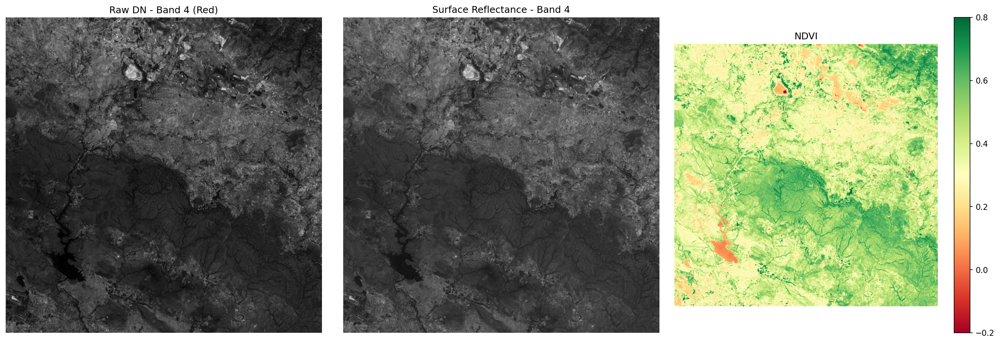

# Landsat L1 Processing Pipeline

End-to-end radiometric and geometric correction pipeline for Landsat 8/9 Collection 2 Level-1 data built to demonstrate L0/L1 processing, atmospheric calibration, and geometric calibration skills.

## What this pipeline does
- Loads raw Landsat L1 data (DN values)
- Converts DN to Radiance using MTL scaling factors
- Converts Radiance to TOA Reflectance (sun angle normalized)
- Applies atmospheric correction using 6S radiative transfer model parameters
- Verifies geometric correction and coordinate system accuracy
- Calculates NDVI from atmospherically corrected bands
- Outputs analysis-ready Surface Reflectance GeoTIFF

## Data
- Sensor: Landsat 8 OLI
- Scene: LC08_L1TP_141045_20260412
- Location: West Bengal, India (UTM Zone 44N)
- Cloud Cover: 0%
- Image Quality: 9/10

## Tools used
- Python, rasterio, numpy, matplotlib, Py6S, QGIS

## Results
- TOA Reflectance Band 4 Mean: 0.1136
- Surface Reflectance Band 4 Mean: 0.0827
- Atmospheric contribution removed: ~0.03 units
- NDVI Min: -0.38 | Max: 0.85 | Mean: 0.43
  ## Geometric Correction
The Landsat 8 L1TP product used in this pipeline is systematically 
orthorectified by USGS before distribution. Geometric accuracy was 
verified programmatically by extracting Ground Control Points and 
confirming the affine transform.

- Ground Control Points used by USGS: 690
- Geometric RMSE: 5.952m (sub-pixel accuracy at 30m resolution)
- CRS: EPSG:32644 (UTM Zone 44N)
- Additional warping not required — existing correction within acceptable limits

This is consistent with standard L1TP processing where systematic 
geometric correction is applied prior to data distribution.

